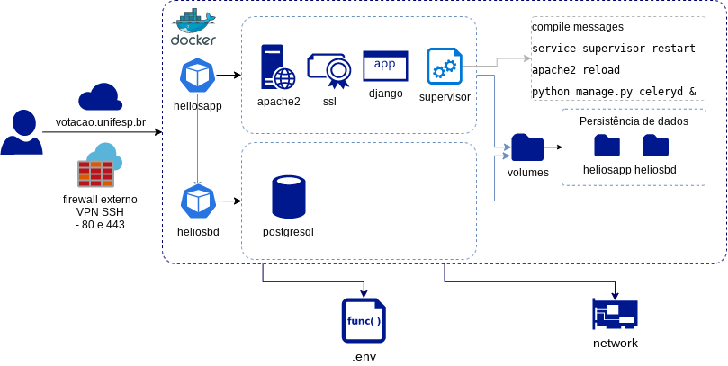

# Helios Voting Docker

> Proposta para execução do helios voting em container docker

## Informações

Essa é uma proposta inicial do Helios Voting adaptado para ser executado em container docker e baseado na versão publicada no repositório do IFSC.

Para detalhes acesse: [https://github.com/ifsc/helios-server]

## Requisitos

docker e docker-compose:

    - docker version 19.03.13
    - docker-compose version 1.27.3

## Estrutura


## Como executar

### Clone o repositório

- clone o repositório [git clone https://git.unifesp.br/votacao-unifesp/heliosdocker.git]

- acesse a pasta criada e execute:

    ```
    docker-compose -up -d
    ```

- serão criados dois containers:
    - heliosapp (helios)
    - heliosbd (postgresql)

### Verifique se os container estão ativos

    ```
    docker-compose ps
    ```

### Execução da aplicação

```
Os serviços essenciais são iniciados no container heliosapp
Verifique se os serviços estão executando: docker-compose exec heliosapp ps aux
Devem estar ativos os serviços: apache2, celeryd e supervisor.
```

### Execução

O container será executado na porta 8080 (se necessário, altere no .ENV) do host e será redirecionado para 443 (https)

Abra o navegador e acesse:
```
https://localhost 
```
A porta pode ser alterada no .ENV ou diretamente no docker-compose.


### Ajustes no .ENV

Crie o arquivo .ENV no seguinte formanto:
```
#POSTGRES
POSTGRES_DB= database
POSTGRES_USER= user
POSTGRES_PASSWORD= password
POSTGRES_HOST= heliosbd
POSTGRES_PORT= 5432
PGDATA= /var/lib/postgresql/data
AUTH_METHOD= md5

#DJANGO
SITE_TITLE='SISTEMA DE VOTAÇÃO'
ADMINS_NAME='Admin'
ADMINS_EMAIL= 'email'
SECRET_KEY=generatekey
PORT_HOST=8080
DEBUG = 0
ALLOWED_HOSTS = 'localhost'
URL_HOST = https://localhost

AUTH_LDAP_SERVER_URI = ldap://server.br
AUTH_LDAP_BIND_DN = "cn=user,dc=domain,dc=br"
AUTH_LDAP_BIND_PASSWORD = password
AUTH_LDAP_USER_SEARCH = dc=domain,dc=br

EMAIL_HOST = smtp-relay.gmail.com
EMAIL_PORT = 587
EMAIL_HOST_USER = ''
EMAIL_HOST_PASSWORD = ''
EMAIL_USE_TLS = False

#CONTAINER: user, group
uid=1001
gid=1001
user=helios
group=helios
dir=eleicao
```
Se necessário, crie novos parâmetros e incluia no settings.py utilizando "get_from_env".
Ex: get_from_env('POSTGRES_DB')

### Volumes

Todos os mapeamentos estão na pasta /volumes.  São eles:

    - ./volumes/helios-server:/home/eleicao
    - ./volumes/apache:/etc/apache2/sites-available
    - ./volumes/log:/var/log/apache2
    - ./volumes/certs:/etc/ssl/private-unifesp
    - ./volumes/bd:/var/lib/postgresql/data    

### Fixando o IPs
Exemplo de configuração do Docker-Compose
```
networks:
  heliosnetwork:
    driver: bridge
    ipam:
     config:
       - subnet: 10.x.x.x/16
         gateway: 10.x.x.x
      
## Status do projeto
O projeto está em desenvolvimento e ajustes serão providenciados. O container heliosapp ainda possui muitas responsabilidades, apesar de ser um anti-pattern, o container é executado sem erros e os serviços essenciais (supervisor, celeryd) são inicializados permintindo execução do helios. 

## Colaboradores
Felipe Silveira (silveira.felipe@unifesp.br)
Francismar N. Silva (fnsilva@unifesp.br)
Thiago Nunes (thiago.nunes@unifesp.br)
Walfran Araújo (walfran.carvalho@unifesp.br)
